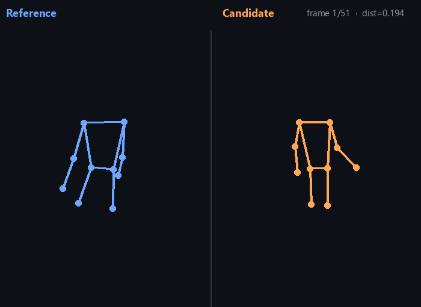
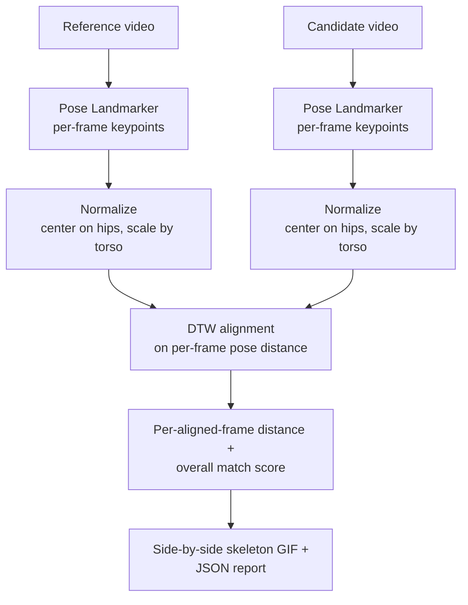

# AI Dance Coach

A computer-vision "dance coach" that compares two takes of the same routine — pose by pose,
frame by aligned frame — and shows exactly where they diverge. Still a work in progress, but the
core pipeline (pose extraction → alignment → scoring → visualization) actually runs end to end
on real footage now, not just a plan.

## About / Motivation

I started this passion project while practicing alone in Singapore while my troupe was
rehearsing in India. I wanted a way to self-correct without a partner — so I combined two things
I love: dance and AI. The idea: use pose estimation to track a dancer's movement, compare it to
reference choreography, and give feedback on posture, timing and alignment — like a coach by
your side.

I paused development while juggling my NUS AI coursework, performances and an internship at
SGH. Picking it back up now that things have settled.



The clip above compares two of my own practice takes: **match score 90.6/100**, with the
largest divergence flagged around the 1.4-3.4s mark of the reference take (visible in
[`assets/demo_report.json`](assets/demo_report.json), generated by the pipeline, not hand-written).

## What's actually built vs. still planned

- [x] Dataset: real practice recordings (kept local, not committed -- see below)
- [x] Pose estimation: MediaPipe Pose Landmarker, run on real video
- [x] Normalization: pose made invariant to camera distance/aspect ratio (centered on mid-hip,
      scaled by torso length) so two differently-framed videos are actually comparable
- [x] Temporal alignment: two takes are never frame-synchronized (different tempo, different
      start offset) -- solved with DTW, not a naive same-index comparison (see below for why that
      distinction is real, not academic)
- [x] Scoring: a 0-100 match score, plus the specific timestamp ranges where the two takes
      diverge most
- [x] Visualization: side-by-side stick-figure comparison, rendered from the real pipeline output
- [ ] Posture-specific feedback ("your left arm is too low") rather than just a distance number
- [ ] Rhythm/timing feedback as its own signal, separate from pose shape
- [ ] Real-time/webcam mode
- [ ] Simple UI (Streamlit/Gradio) instead of a CLI

## Why DTW alignment, not a naive frame-by-frame comparison

Two takes of the same routine are never the same length or tempo -- comparing frame 50 of a
slightly slower take to frame 50 of a faster one compares the wrong moments to each other and
produces a meaningless score. I validated this concretely rather than just asserting it: taking
one real practice clip and comparing it to a copy of itself shifted 4 seconds later (so it's
*known* to be the same movement, just offset),

- **naive same-index comparison**: mean pose distance 0.281 (reads as a mediocre, uncorrelated
  match -- wrong, since it's literally the same clip)
- **DTW-aligned comparison**: mean pose distance 0.039, match score 97.4/100 (correctly
  recognizes it as the same movement)

That's the actual gap DTW closes, measured, not assumed.

## Why skeletons, not video, in the committed demo

The pipeline can draw the comparison over the real camera frames, but the practice footage was
filmed casually and isn't something I want sitting in a public repo by default. The committed
demo renders only the extracted stick-figure skeleton on a blank background -- same real pipeline
output, no camera footage leaves the repo. Raw practice videos stay local and gitignored; point
`src/compare_videos.py` at your own two clips to reproduce this with different footage.

## How it works



1. **`src/pose_estimation.py`** -- samples each video at ~5fps and runs MediaPipe's Pose
   Landmarker (the Tasks API; see "A real API-compatibility bug" below for why it's not the
   `mp.solutions.pose` API most tutorials show). Landmarks are re-centered on the mid-hip point
   and scaled by shoulder-to-hip (torso) length, in pixel space (not MediaPipe's raw 0-1
   normalized coordinates, which would distort comparisons between differently-shaped video
   frames) -- so two videos shot at different distances, resolutions, or aspect ratios land on
   the same footing.
2. **`src/pose_compare.py`** -- Dynamic Time Warping over the two pose sequences, with a banded
   window (capped at ~35% of sequence length) so alignment can't degenerate into matching one
   whole sequence to a single frame of the other. Per-frame distance is a visibility-weighted
   mean joint distance, so an occluded ankle in one frame doesn't dominate the score.
3. **`src/visualize.py`** -- renders the aligned pairs as a side-by-side stick-figure GIF.
4. **`src/compare_videos.py`** -- the CLI that ties it together and writes both the GIF and a
   JSON report (match score, worst-deviation timestamps).

## Inspiration

Conceptually inspired by [goodCycle/AI-Dance-Coach](https://github.com/goodCycle/AI-Dance-Coach)
(a CS470 term project comparing dance poses via OpenPose + a Flask backend + a React Native iOS
app) -- no code shared, it's a from-scratch implementation with a different, much smaller stack:
MediaPipe instead of OpenPose (no GPU/CUDA/Caffe setup required), DTW-based temporal alignment
(their approach compares frames directly), and a local Python CLI instead of a mobile app +
server deployment.

## Real bugs found while building this

- **`requirements.txt` had a stray zero-width-space character on its own line**, which broke
  `pip install -r requirements.txt` outright for anyone who tried to actually use it. Removed.
- **MediaPipe's Python API changed incompatibly between versions.** `mp.solutions.pose` -- the
  API almost every MediaPipe pose-estimation tutorial uses -- was removed entirely as of
  MediaPipe 0.10.30+; there's no version of it with Python 3.13 wheels at all. Rewrote
  `pose_estimation.py` around the current Tasks API (`mediapipe.tasks.python.vision`), which
  needs a separate model file -- handled with an auto-download on first run rather than a manual
  setup step (same fix pattern as a Tesseract-path issue I found in another repo).
- **MediaPipe's native bindings don't load on Python 3.13 on Windows** (`AttributeError:
  function 'free' not found`, from its `ctypes`-based shared-library loader) -- works correctly
  on Python 3.11. Documented below; this project needs 3.11 until MediaPipe's Windows/3.13
  support matures.

## Local Setup

MediaPipe's native bindings currently require **Python 3.11** on Windows (see above) -- using
a newer Python will fail at import/model-load time, not at `pip install` time.

```bash
# create a Python 3.11 environment (conda example)
conda create -n ai-dance-coach python=3.11 -y
conda activate ai-dance-coach

pip install -r requirements.txt

# compare two of your own takes (any two videos of the same routine)
python -m src.compare_videos --reference path/to/take1.mp4 --candidate path/to/take2.mp4 --out outputs/comparison.gif
```

The MediaPipe pose model (~5MB) auto-downloads to `models/` on first run -- no manual step.

## Repo Structure

```text
.
|-- README.md
|-- requirements.txt
|-- .gitignore
|-- assets/
|   |-- demo.gif            # committed showcase output (skeleton-only, see above)
|   `-- demo_report.json    # the real report the pipeline generated for that run
|-- data/                   # your own practice videos go here (gitignored, not committed)
|-- notebooks/
|   `-- 01_data_prep.ipynb  # early frame-extraction exploration -- superseded by src/pose_estimation.py
`-- src/
    |-- data_extraction.py  # early frame-extraction script (from the original data-prep pass)
    |-- preprocessing.py    # early image-resizing script
    |-- pose_estimation.py  # MediaPipe pose extraction + normalization
    |-- pose_compare.py     # DTW alignment + scoring
    |-- visualize.py        # skeleton rendering + comparison GIF
    `-- compare_videos.py   # CLI entry point
```

`models/` and `outputs/` are gitignored -- the model file auto-downloads, and per-run output
regenerates every time you run the CLI against your own videos.
